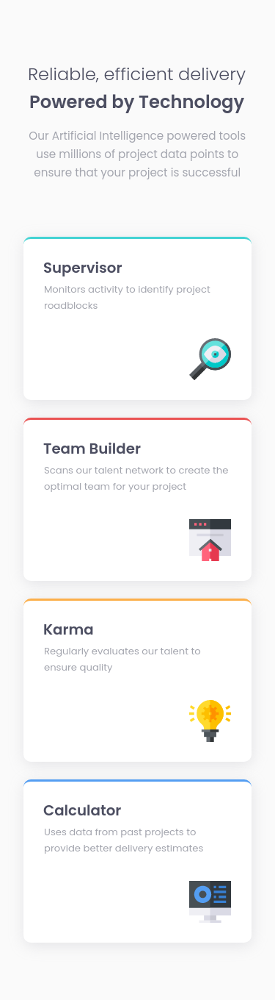
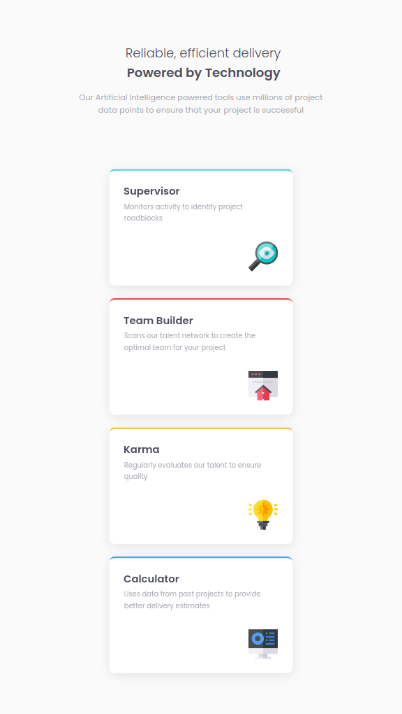
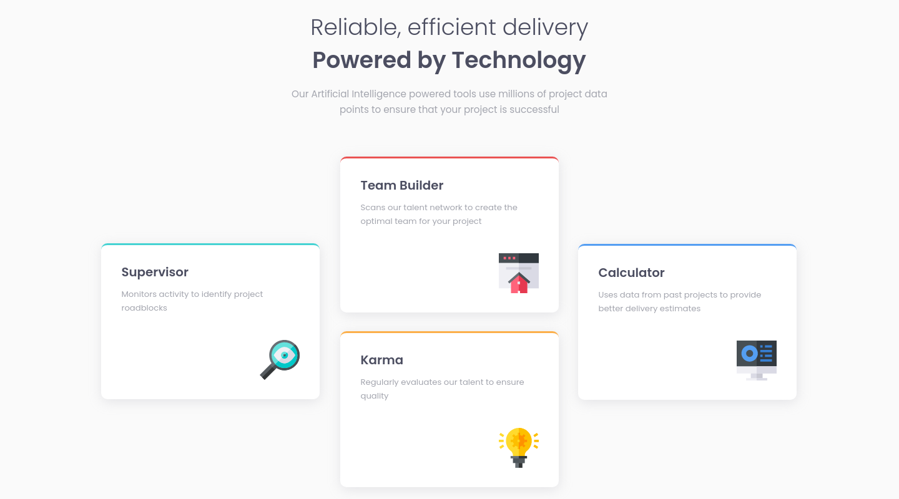
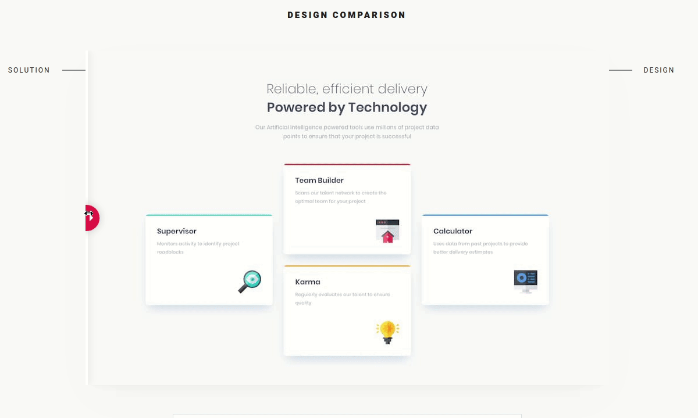

# Frontend Mentor - Single price grid component solution

This is a solution to the [Single price grid component challenge on Frontend Mentor](https://www.frontendmentor.io/challenges/single-price-grid-component-5ce41129d0ff452fec5abbbc). Frontend Mentor challenges help you improve your coding skills by building realistic projects.

## Table of contents

- [Overview](#overview)
  - [The challenge](#the-challenge)
  - [Screenshot](#screenshot)
  - [Links](#links)
- [My process](#my-process)
  - [Built with](#built-with)
  - [What I learned](#what-i-learned)
  - [Useful resources](#useful-resources)
- [Author](#author)

## Overview

This is the front-end mentor's seventh challenge. The challenge is to build the "Single price grid" and make it as close to the design as possible. Building the desing with whatever you want to finish, any language, framework or tools.

### The challenge

Users should be able to:

- View the optimal layout for the component depending on their device's screen size
- See a hover state on desktop for the Sign Up call-to-action
<!--

## Screenshot

### Mobile design

<p  align="center">
  </img>
</p>

### Tablets design

<p  align="center"></img></p>

### Desktop design

<p  align="center"></img></p>

### result of my work

<p  align="center"></img></p> -->

### Links

<!--
- Solution URL: [My solution for this challenge](https://www.frontendmentor.io/solutions/four-cards-with-reactjs-ZfgqtqlIl)
- Live Site URL: [check the result ](https://jdcmeira-four-card.netlify.app) -->

- My figma design: [Figma](https://www.figma.com/file/qoi5g7sQ81YZysFwJJoWIz/07---Single-price?node-id=0%3A1)

## My process

### Built with

- Flexbox
- Mobile-first workflow
- [React](https://reactjs.org/) - JS library

### What I learned

<!--
It is possible to merge or separate css for each element, with common parts being added for all indicated elements, while specific parts only for the desired element.

```CSS
  .field1,
  .field2,
  .field3 {
    width: 40rem;
    display: flex;
    flex-direction: column;
    align-items: center;
    justify-content: center;
  }

  .field1 {
    padding: 14.9rem 0 0 3.4rem;
  }

  .field2 {
    padding: 1rem 0 1.8rem 0;
  }
  .field3 {
    padding: 15rem 0 0 0rem;
  }
``` -->

### Useful resources

- [react tutorial](https://pt-br.reactjs.org/tutorial/tutorial.html) - This helped me structure the components and build the proposed page.
- [my figma design](https://www.figma.com/file/qoi5g7sQ81YZysFwJJoWIz/07---Single-price?node-id=0%3A1) - My figma design for help anyone who wants to build this challenge.
- [CSS units conversor - px to VH/VW/REM](https://it-news.pw/pxtovh/) - CSS units conversor .
- [Converting Colors](<https://convertingcolors.com/hsl-color-179_62_43.html?search=HSL(179°,%2062%,%2043%)>) - HSL for all color systems.

## Author

- Personal Page - [Jean Carlos De Meira](https://jcdmeira.github.io)
- Frontend Mentor - [@JCDMeira](https://www.frontendmentor.io/profile/JCDMeira)
- Instagram - [@jean.meira10](https://www.instagram.com/jean.meira10/)
- GitHub - [JCDMeira](https://github.com/JCDMeira)
